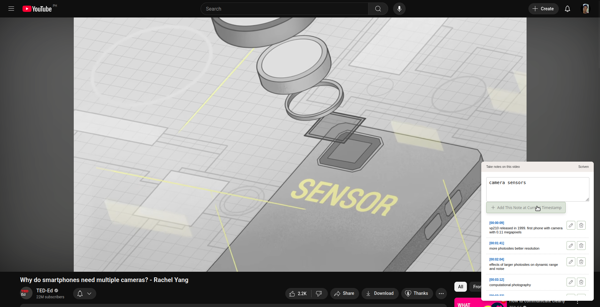

# scriven

Write notes to YouTube videos.

## Screenshots

<div>


</div>

## Development & Packaging

To package for a particular browser:

```sh
chmod +x ./package.sh

./package.sh [firefox|chrome]
```

This will generate a `dist` directory with a subdir and zip archive for the target platform.

```
dist/
├── chrome
│   ├── lib
│   │   └── browser-polyfill.min.js
│   ├── manifest.json
│   └── src
│       ├── background.js
│       ├── content.js
│       └── ui.js
├── firefox
│   ├── lib
│   │   └── browser-polyfill.min.js
│   ├── manifest.json
│   └── src
│       ├── background.js
│       ├── content.js
│       └── ui.js
├── scriven_chrome.zip
└── scriven_firefox.zip
```